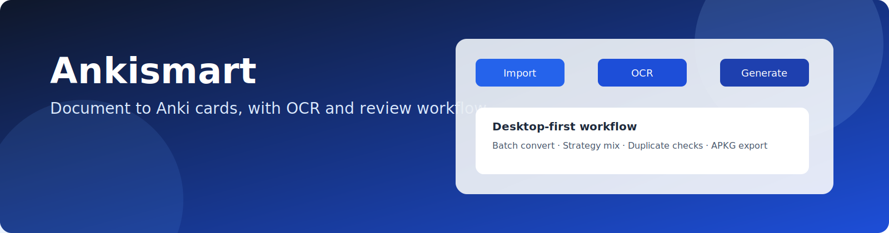
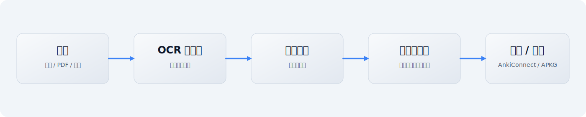

# Ankismart

<p align="center">
  
</p>

<p align="center">
  <a href="./README.md">简体中文</a> ·
  <a href="./README.en.md">English</a>
</p>

<p align="center">
  
  
  
  
</p>

---

Ankismart 是一个基于 PyQt6 的桌面端智能制卡工具：导入文档 -> 提取内容（含 OCR）-> 生成 Anki 卡片 -> 预览编辑 -> 推送或导出 APKG。

<p align="center">
  
</p>

### 核心能力

- 多格式导入：`md`、`txt`、`docx`、`pptx`、`pdf`、图片
- 智能 OCR：本地模型按需下载（不内置模型），支持模型档位切换
- 卡片生成：支持多种题型与策略配比
- 结果复核：批量编辑标签/牌组、重试失败项、导出 APKG
- 主题与界面：侧边栏主题切换（浅色 / 深色 / 跟随系统）

### 使用前准备

- Python `3.11+`
- 建议使用 `uv` 管理 Python 环境与依赖
- 已安装桌面版 Anki，并安装 AnkiConnect 插件（默认端口 `8765`）
- 在设置页至少配置一个可用的 LLM 提供商（模型、地址、API Key）
- 如需处理 PDF/图片，首次使用 OCR 时会按需下载模型

### 应用流程

1. 启动应用并加载本地配置（主题、语言、LLM 提供商、Anki 连接、OCR 策略）。
2. 在导入页选择文件，设置牌组、标签、目标卡片总数与策略比例。
3. 批量转换文档：按类型分组处理，文本文件直转，PDF/图片进入 OCR 流程，输出 Markdown。
4. 在预览页检查并编辑 Markdown 内容。
5. 开始生成时，程序先在本地将“策略比例 + 目标总数”换算为每种策略的具体数量，并分配到各文档。
6. 对每个策略发起 LLM 请求，请求中带 `target_count`，并在提示词中明确 `Generate exactly N cards`。
7. 解析模型返回并做后处理，构建标准化卡片草稿。
8. 在卡片预览页按类型查看、筛选和微调卡片。
9. 推送到 Anki（仅新增 / 仅更新 / 新增或更新），记录逐卡结果。
10. 在结果页查看统计，执行失败重试、编辑后重推或导出 APKG。

### 快速开始

#### 1) 环境准备

- 建议使用 `uv` 管理 Python 环境

#### 2) 安装依赖并运行

```bash
uv sync
uv run python -m ankismart.ui.app
```

#### 3) 首次配置建议

- 在设置页先测试 LLM 提供商连通性
- 测试 AnkiConnect 连通性（确保 Anki 正在运行）
- 再返回导入页开始批量制卡

### 打包发布（安装版 + 便携版）

项目已提供一键脚本，默认生成：

- 安装版（Inno Setup，可选）
- 便携版（ZIP）

```bash
# 完整构建（若本机安装了 Inno Setup，会同时产出安装包）
uv run python packaging/build.py --clean

# 仅构建应用分发目录 + 便携版
uv run python packaging/build.py --clean --skip-installer
```

输出目录结构（扁平且清晰）：

```text
dist/release/
├─ app/                      # 安装版源目录（无 OCR 模型）
├─ portable/
│  ├─ Ankismart-Portable-x.y.z/
│  └─ Ankismart-Portable-x.y.z.zip
└─ installer/
   └─ Ankismart-Setup-x.y.z.exe
```

### 常见问题

- 无法连接 AnkiConnect
  - 确认 Anki 已启动、AnkiConnect 已安装且 URL 与密钥配置正确
- 生成卡片数量异常
  - 检查目标总数与策略比例是否正确，至少一个策略比例需大于 0
- OCR 无法使用
  - 确认使用完整版安装包，并在首次运行时完成 OCR 模型下载

### 技术栈

- UI：PyQt6 + PyQt-Fluent-Widgets
- OCR：PaddleOCR + PaddlePaddle
- 文档处理：python-docx / python-pptx / pypdfium2
- LLM：OpenAI 兼容接口
- Anki 集成：AnkiConnect + genanki
