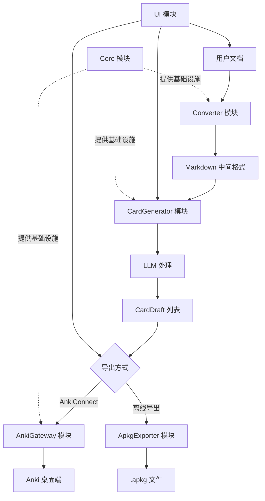
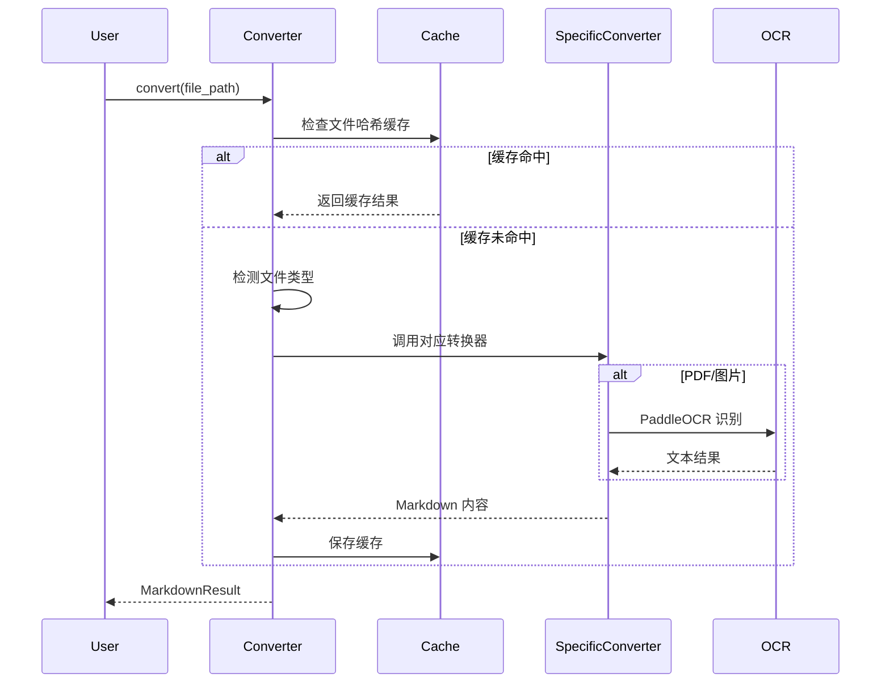
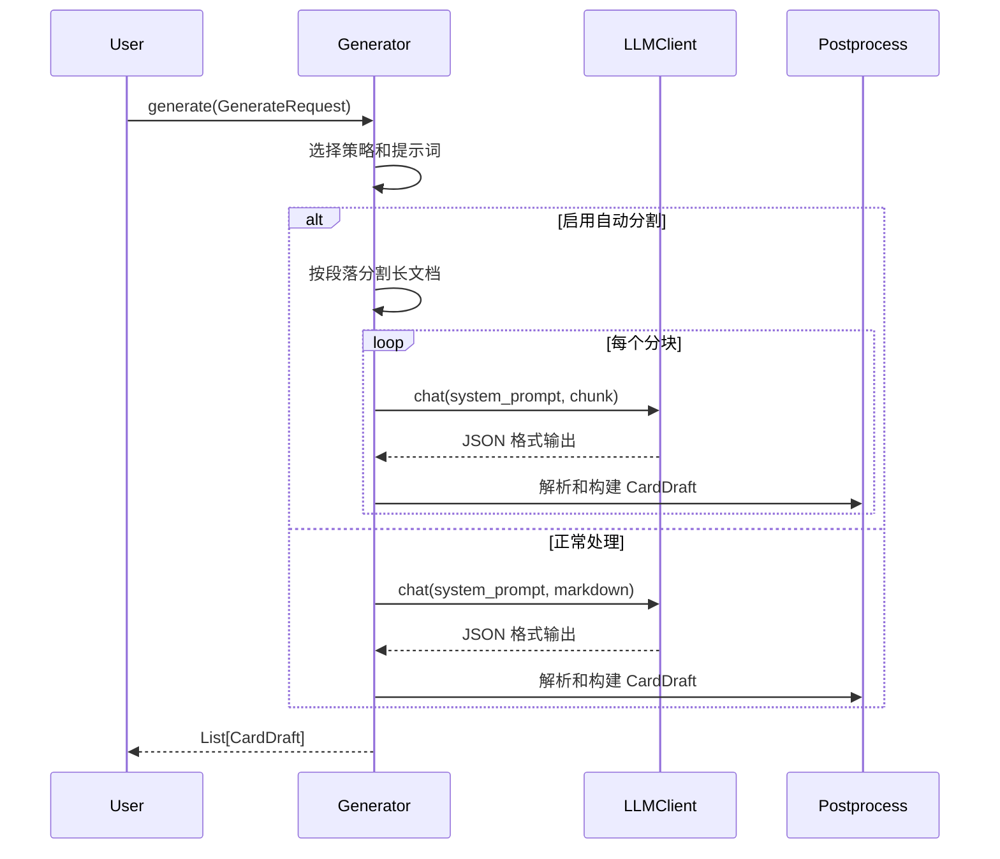
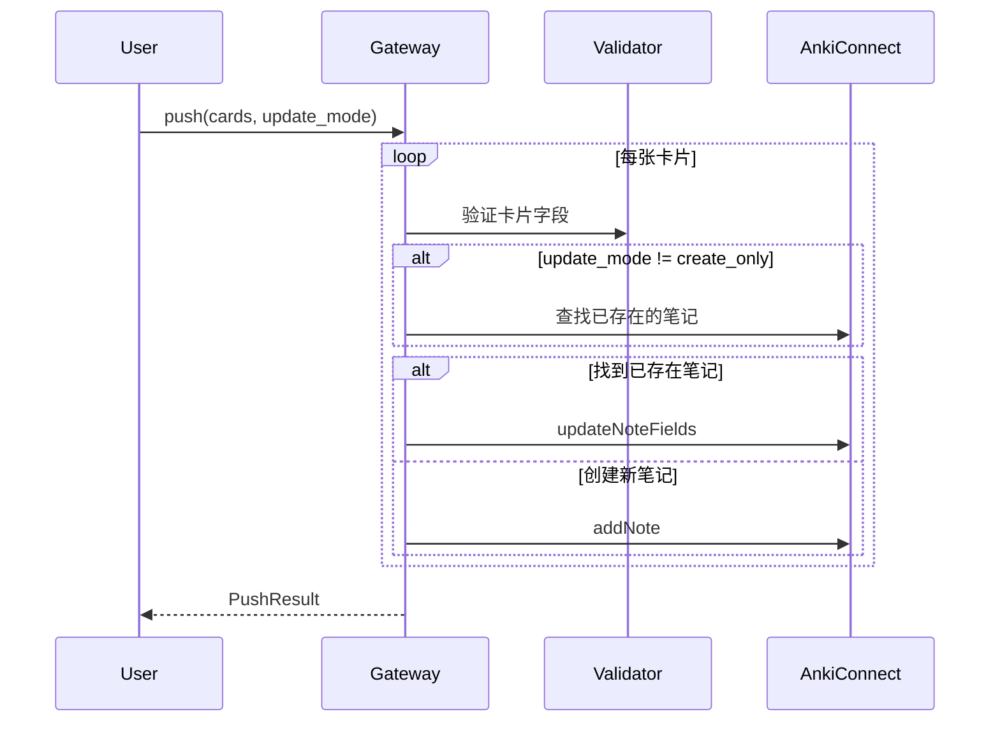
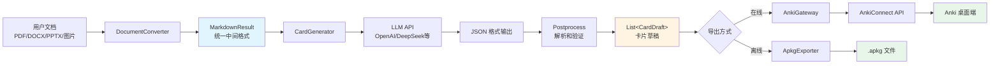

# Ankismart 架构文档

## 概述

Ankismart 是一个智能 Anki 闪卡生成工具，能够将各种文档格式（PDF、Word、PPT、图片等）转换为 Anki 闪卡。项目采用模块化设计，核心流程为：**文档 → Markdown → LLM → CardDraft → Anki**。

## 整体架构



## 模块划分

### 1. Core 模块 (`ankismart.core`)

**职责**：提供核心基础设施和共享组件

**主要组件**：
- `models.py` - 数据模型定义（CardDraft、MarkdownResult、GenerateRequest 等）
- `config.py` - 配置管理（AppConfig、LLMProviderConfig）
- `errors.py` - 统一异常体系（ConvertError、CardGenError、AnkiGatewayError）
- `logging.py` - 结构化日志系统
- `tracing.py` - 性能追踪和指标收集
- `crypto.py` - 敏感信息加密（API Key 等）
- `interfaces.py` - 协议定义（IConverter、ICardGenerator、IAnkiGateway）

**设计理念**：
- 使用 Pydantic 进行数据验证和序列化
- 统一的错误码体系（ErrorCode 枚举）
- 每个请求分配唯一 trace_id 用于追踪

### 2. Converter 模块 (`ankismart.converter`)

**职责**：将各种文档格式转换为统一的 Markdown 格式

**主要组件**：
- `converter.py` - 主转换器，负责调度和缓存
- `detector.py` - 文件类型检测
- `docx_converter.py` - Word 文档转换
- `pptx_converter.py` - PowerPoint 转换
- `ocr_converter.py` - PDF 和图片 OCR 识别（基于 PaddleOCR）
- `markdown_converter.py` - Markdown 文件处理
- `text_converter.py` - 纯文本处理
- `cache.py` - 转换结果缓存（基于文件哈希）

**转换流程**：


**支持格式**：
- Markdown (`.md`)
- 纯文本 (`.txt`)
- Word 文档 (`.docx`)
- PowerPoint (`.pptx`)
- PDF (`.pdf`) - 通过 OCR
- 图片 (`.png`, `.jpg`, `.jpeg`, `.bmp`, `.tiff`, `.webp`) - 通过 OCR

#### OCR 子系统改造设计（2026-02）

为解决 OCR 相关逻辑在运行中出现的“配置漂移、线程行为不一致、设备检测阻塞、下载与转换互相影响”等问题，OCR 子系统按职责划分为 4 个逻辑层（先逻辑解耦，再逐步物理解耦）：

1. `PDF 解析层`：
- 职责：PDF 文字层探测、页渲染、图片流式产出。
- 边界：只返回“可提取文本”或“逐页图像”，不感知模型/设备。
- 关键约束：必须在函数内部关闭 `PdfDocument` 与图像资源，避免长任务句柄泄漏。

2. `OCR 引擎管理层`：
- 职责：`PaddleOCR` 单例生命周期、CPU/GPU 参数组装、oneDNN 回退策略。
- 边界：仅关心“如何初始化/重建引擎”，不直接发起模型下载。
- 关键约束：重建必须显式触发，避免 UI 任意设置变更导致 OCR 引擎被无关重置。

3. `设备检测层`：
- 职责：检测 CUDA 可用性并缓存结果。
- 边界：对外提供 `is_cuda_available(force_refresh=False)`，UI 可手动强制刷新。
- 关键约束：缓存需要 TTL，避免“一次检测结果永久有效”造成误导。

4. `模型下载与仓储层`：
- 职责：缺失模型探测、串行下载、下载后校验。
- 边界：提供明确错误类型（下载中/网络失败/校验失败）。
- 关键约束：下载过程加锁，防止并发下载污染本地模型目录状态。

**迁移步骤（分阶段）**

1. P0（稳定性优先）：
- 统一 UI 侧 `BatchConvertWorker` 接口，消除导入页信号缺失崩溃。
- OCR runtime 适配器兼容旧签名（`reset_ocr_instance` 可选）并在设置页/导入页行为一致。
- 设置页仅在 OCR 相关配置变化时重建 OCR 引擎，去掉“全量设置变更触发重建”。

2. P1（结构与可维护性）：
- 引擎管理、设备检测、模型下载分别引入独立状态控制（锁、缓存、事件日志）。
- PDF 文字层判定从固定长度阈值改为“有效文本”判定，减少误判。
- OCR 日志统一事件名，保证问题定位链路完整。

3. P2（体验和观测）：
- 设备检测与下载支持前台状态可视化（进行中/成功/失败/重试）。
- 增加 OCR 任务级 trace 字段，支持按文件与阶段检索。

**回滚策略**

- 保留现有 `ocr_converter.convert/convert_image/configure_ocr_runtime` 对外接口不变。
- 若新检测/下载策略出现兼容问题，可单独回退对应内部函数，不影响 UI 调用层。

**测试策略**

1. 单元测试：
- 设备检测缓存、强制刷新、下载并发锁、模型缺失与下载后校验。
- PDF 文字层短文本、空文本、图像页混合场景。

2. UI 测试：
- 导入页启动转换流程（含 OCR 文件）不崩溃。
- 设置页语言/代理/OCR 选项切换不触发无关 OCR 重建。

3. 回归测试：
- `uv run pytest tests/test_ui/test_import_page.py`
- `uv run pytest tests/test_ui/test_workers.py`
- `uv run pytest tests/test_ui/test_settings_page.py`（已知 Qt 不稳定用例除外）
- `uv run pytest tests/test_converter/test_ocr_converter.py`

### 3. CardGen 模块 (`ankismart.card_gen`)

**职责**：使用 LLM 从 Markdown 生成 Anki 闪卡

**主要组件**：
- `generator.py` - 卡片生成器主逻辑
- `llm_client.py` - LLM 客户端（支持 OpenAI SDK 兼容接口）
- `prompts.py` - 各种策略的系统提示词
- `postprocess.py` - LLM 输出解析和后处理

**支持策略**：
- `basic` - 基础问答卡片
- `cloze` - 填空题卡片
- `concept` - 概念解释卡片
- `key_terms` - 关键术语卡片
- `single_choice` - 单选题卡片
- `multiple_choice` - 多选题卡片
- `image_qa` - 图片问答卡片
- `image_occlusion` - 图片遮挡卡片（别名）

**生成流程**：


**LLM 客户端特性**：
- 支持自定义 base_url（兼容 OpenAI、DeepSeek、Moonshot、智谱、通义千问等）
- 自动重试机制（指数退避）
- RPM 限流（每分钟请求数控制）
- 代理支持
- Token 使用统计

### 4. AnkiGateway 模块 (`ankismart.anki_gateway`)

**职责**：与 Anki 交互，支持在线推送和离线导出

**主要组件**：
- `gateway.py` - Anki 网关主逻辑
- `client.py` - AnkiConnect 客户端
- `apkg_exporter.py` - APKG 文件导出器
- `validator.py` - 卡片草稿验证
- `styling.py` - 卡片样式定义

**更新模式**：
- `create_only` - 仅创建新卡片（默认）
- `update_only` - 仅更新已存在的卡片
- `create_or_update` - 创建或更新

**推送流程**：


**APKG 导出**：
- 使用 genanki 库生成 .apkg 文件
- 支持媒体附件（图片、音频、视频）
- 支持多牌组导出
- 自动处理媒体文件（本地路径、URL、Base64）

### 5. UI 模块 (`ankismart.ui`)

**职责**：提供图形用户界面

**主要组件**：
- `app.py` - 应用入口和主循环
- `main_window.py` - 主窗口框架
- `import_page.py` - 文档导入页面
- `result_page.py` - 结果展示和编辑页面
- `preview_page.py` - Markdown 预览页面
- `settings_page.py` - 设置页面
- `card_edit_widget.py` - 单卡编辑组件
- `workers.py` - 后台任务线程（转换、生成、推送）
- `i18n.py` - 国际化支持（中文/英文）
- `styles.py` - 样式定义

**技术栈**：
- PySide6 - Qt 6 Python 绑定
- QFluentWidgets - Fluent Design 风格组件库
- QThread - 异步任务处理

**UI 架构**：
```
MainWindow
├── NavigationInterface (侧边栏)
├── StackedWidget (页面容器)
│   ├── ImportPage (导入页面)
│   ├── PreviewPage (预览页面)
│   ├── ResultPage (结果页面)
│   └── SettingsPage (设置页面)
└── StatusBar (状态栏)
```

## 数据流图

### 完整数据流



### 核心数据模型

**MarkdownResult**（转换器输出）：
```python
{
    "content": str,        # Markdown 内容
    "source_path": str,    # 源文件路径
    "source_format": str,  # 文件格式
    "trace_id": str        # 追踪 ID
}
```

**CardDraft**（卡片草稿）：
```python
{
    "schema_version": "1.0",
    "trace_id": str,
    "deck_name": str,           # 牌组名称
    "note_type": str,           # 笔记类型（Basic/Cloze）
    "fields": {                 # 字段内容
        "Front": str,
        "Back": str
    },
    "tags": List[str],          # 标签
    "media": {                  # 媒体附件
        "audio": List[MediaItem],
        "video": List[MediaItem],
        "picture": List[MediaItem]
    },
    "options": {                # 选项
        "allow_duplicate": bool,
        "duplicate_scope": str
    },
    "metadata": {               # 元数据
        "source_format": str,
        "source_path": str,
        "generated_at": str
    }
}
```

## 技术栈说明

### 核心依赖

| 库名 | 版本 | 用途 |
|------|------|------|
| PySide6 | ≥6.6 | Qt 6 GUI 框架 |
| pyside6-fluent-widgets | ≥1.5 | Fluent Design 组件库 |
| openai | ≥1.0 | LLM API 客户端（兼容多提供商） |
| paddleocr | ≥2.7 | OCR 文字识别 |
| paddlepaddle | ≥2.5 | PaddleOCR 后端 |
| genanki | ≥0.13 | APKG 文件生成 |
| pydantic | ≥2.0 | 数据验证和序列化 |
| python-docx | ≥1.0 | Word 文档解析 |
| python-pptx | ≥0.6 | PowerPoint 解析 |
| pypdfium2 | ≥4.30 | PDF 渲染（用于 OCR） |
| httpx | ≥0.25 | HTTP 客户端（代理支持） |
| pyyaml | ≥6.0 | 配置文件解析 |
| cryptography | ≥41.0 | 敏感信息加密 |

### 开发依赖

| 库名 | 版本 | 用途 |
|------|------|------|
| pytest | ≥7.0 | 单元测试框架 |
| pytest-cov | ≥4.0 | 测试覆盖率 |
| ruff | ≥0.1 | 代码检查和格式化 |

### Python 版本要求

- **最低版本**：Python 3.11
- **推荐版本**：Python 3.11 或 3.12

## 扩展点

### 1. 添加新的文档格式支持

在 `ankismart.converter` 模块中添加新的转换器：

```python
# my_converter.py
from pathlib import Path
from ankismart.core.models import MarkdownResult

def convert(file_path: Path, trace_id: str) -> MarkdownResult:
    # 实现转换逻辑
    content = "..."
    return MarkdownResult(
        content=content,
        source_path=str(file_path),
        source_format="my_format",
        trace_id=trace_id,
    )
```

然后在 `converter.py` 中注册：

```python
_CONVERTERS["my_format"] = my_converter.convert
```

### 2. 添加新的卡片生成策略

在 `ankismart.card_gen.prompts.py` 中定义新的系统提示词：

```python
MY_STRATEGY_SYSTEM_PROMPT = """
你的提示词内容...
"""
```

在 `generator.py` 中注册策略：

```python
_STRATEGY_MAP["my_strategy"] = (MY_STRATEGY_SYSTEM_PROMPT, "Basic")
```

### 3. 添加新的 LLM 提供商

在 `config.py` 的 `KNOWN_PROVIDERS` 中添加：

```python
KNOWN_PROVIDERS = {
    # ...
    "My Provider": "https://api.myprovider.com/v1",
}
```

只要提供商兼容 OpenAI API 格式，无需修改代码即可使用。

### 4. 自定义卡片样式

修改 `ankismart.anki_gateway.styling.py` 中的 `MODERN_CARD_CSS`：

```python
MODERN_CARD_CSS = """
.card {
    /* 你的自定义样式 */
}
"""
```

## 配置系统

### 配置文件位置

- **默认路径**：`{项目根目录}/.local/ankismart/config.yaml`
- **环境变量**：
  - `ANKISMART_APP_DIR` - 自定义应用目录
  - `ANKISMART_CONFIG_PATH` - 自定义配置文件路径

### 配置结构

```yaml
# LLM 提供商配置（支持多个）
llm_providers:
  - id: "abc123"
    name: "OpenAI"
    api_key: "encrypted:..."
    base_url: "https://api.openai.com/v1"
    model: "gpt-4o"
    rpm_limit: 0

active_provider_id: "abc123"

# Anki 连接配置
anki_connect_url: "http://127.0.0.1:8765"
anki_connect_key: "encrypted:..."

# 默认值
default_deck: "Default"
default_tags: ["ankismart"]

# LLM 参数
llm_temperature: 0.3
llm_max_tokens: 0

# 功能开关
ocr_correction: false
enable_auto_split: false
split_threshold: 70000

# UI 配置
theme: "light"  # light/dark/auto
language: "zh"  # zh/en
proxy_url: ""

# 日志级别
log_level: "INFO"
```

### 敏感信息加密

API Key 等敏感信息使用 Fernet 对称加密存储，加密密钥基于机器 UUID 生成。

## 性能优化

### 1. 转换缓存

- 基于文件哈希的缓存机制
- 避免重复转换相同文件
- 缓存位置：`.local/ankismart/cache/`

### 2. LLM 调用优化

- RPM 限流避免触发速率限制
- 自动重试机制（指数退避）
- 长文档自动分割（可选）

### 3. OCR 优化

- 模型按需下载
- 批量处理 PDF 页面
- 支持 GPU 加速（如果可用）

### 4. UI 响应性

- 所有耗时操作在 QThread 中执行
- 实时进度反馈
- 支持任务取消

## 日志和追踪

### 结构化日志

所有日志使用 JSON 格式，包含：
- `timestamp` - 时间戳
- `level` - 日志级别
- `logger` - 日志器名称
- `message` - 日志消息
- `trace_id` - 追踪 ID（如果有）
- 其他上下文信息

### 性能指标

使用 `@timed` 装饰器记录关键操作耗时：
- `convert_total` - 文档转换总耗时
- `llm_generate` - LLM 生成耗时
- `anki_push_total` - Anki 推送总耗时

### Trace ID

每个请求分配唯一的 trace_id，贯穿整个处理流程，便于问题追踪和性能分析。

## 错误处理

### 错误码体系

```python
class ErrorCode(str, Enum):
    # 通用错误
    E_UNKNOWN = "E_UNKNOWN"

    # 转换错误 (E_CONVERT_*)
    E_FILE_NOT_FOUND = "E_FILE_NOT_FOUND"
    E_FILE_TYPE_UNSUPPORTED = "E_FILE_TYPE_UNSUPPORTED"
    E_CONVERT_FAILED = "E_CONVERT_FAILED"

    # 卡片生成错误 (E_CARD_GEN_*)
    E_LLM_ERROR = "E_LLM_ERROR"
    E_PARSE_ERROR = "E_PARSE_ERROR"

    # Anki 网关错误 (E_ANKI_*)
    E_ANKICONNECT_ERROR = "E_ANKICONNECT_ERROR"
    E_MODEL_NOT_FOUND = "E_MODEL_NOT_FOUND"

    # 配置错误 (E_CONFIG_*)
    E_CONFIG_INVALID = "E_CONFIG_INVALID"
```

### 异常层次

```
AnkismartError (基类)
├── ConvertError (转换错误)
├── CardGenError (卡片生成错误)
├── AnkiGatewayError (Anki 网关错误)
└── ConfigError (配置错误)
```

所有自定义异常都包含：
- `message` - 错误消息
- `code` - 错误码
- `trace_id` - 追踪 ID（可选）

## 测试策略

### 单元测试

- 测试目录：`tests/`
- 运行命令：`pytest`
- 覆盖率报告：`pytest --cov=ankismart --cov-report=html`

### 测试覆盖

- Core 模块：配置加载、数据模型验证
- Converter 模块：各格式转换器
- CardGen 模块：LLM 输出解析
- AnkiGateway 模块：卡片验证、推送逻辑

### 集成测试

- AnkiConnect 连接测试
- LLM API 连接测试
- 端到端流程测试

## 部署

### 开发模式

```bash
# 安装依赖
pip install -e ".[dev]"

# 运行应用
python -m ankismart.ui.app
```

### 生产模式

```bash
# 安装依赖
pip install .

# 运行应用
ankismart
```

### 打包分发

使用 PyInstaller 或 cx_Freeze 打包为独立可执行文件。

## 未来规划

- [ ] 支持更多文档格式（EPUB、HTML 等）
- [ ] 支持更多卡片类型（Image Occlusion、Audio 等）
- [ ] 插件系统
- [ ] Web 版本
- [ ] 云端同步
- [ ] 协作功能
